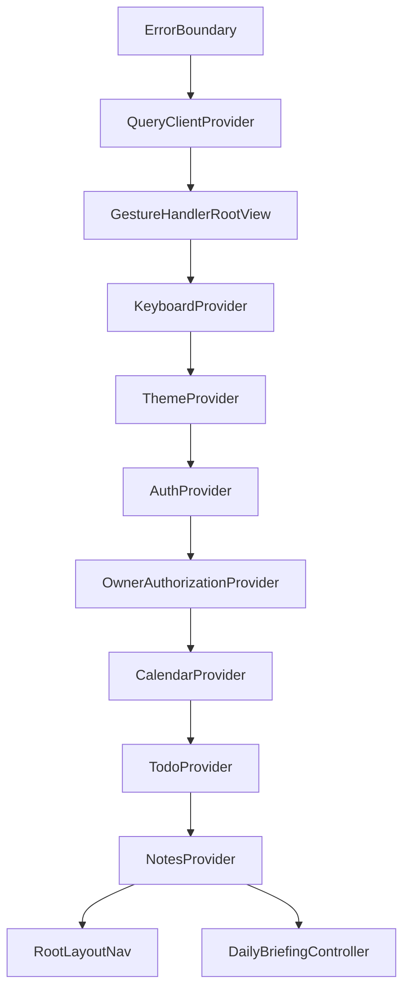
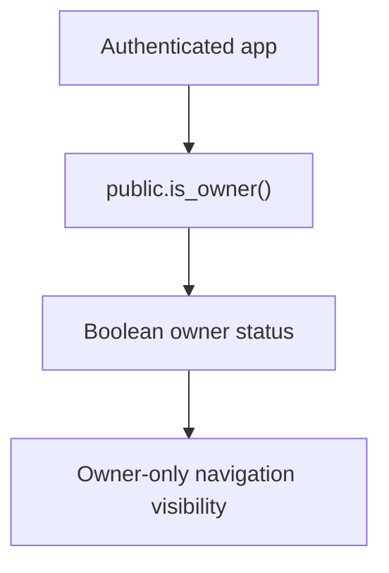
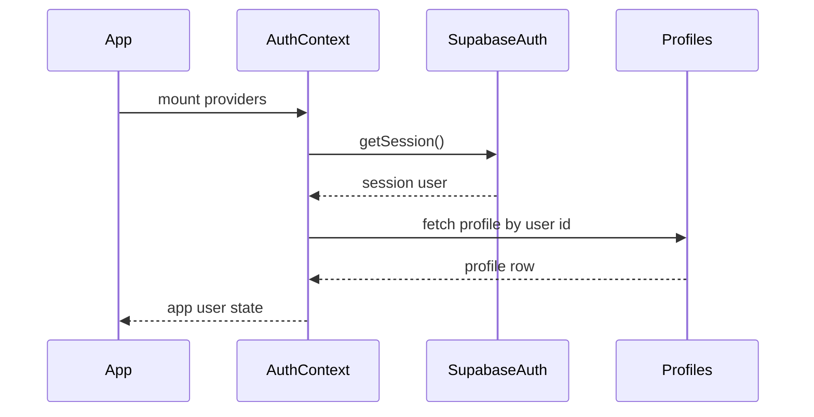

# PJB Daily Architecture

**Status:** Initial architecture documentation  
**Source:** Repository inspection and verified project facts

## Overview

PJB Daily is an Expo React Native application written in TypeScript. It uses Expo Router for navigation, Supabase for authentication and database storage, React Context for primary app state, and AsyncStorage for local persistence such as session storage, theme preference, saved email, editor drafts, and Daily Briefing dismissal state.

## Application Entry

The Expo entry point is configured in `package.json`:

```text
expo-router/entry
```

The root layout is `app/_layout.tsx`. It loads Inter fonts, controls the splash screen, and wraps the app in providers.

## Provider Stack

Confirmed provider order:



## Navigation

Navigation uses Expo Router.

Confirmed routes:

- `/`
- `/auth`
- `/(tabs)`
- `/add-task`
- `/date-details`
- `/edit-note`

The authenticated tab group includes:

- Calendar
- To-Dos
- Notes
- Profile

Unauthenticated users are redirected away from protected tab routes.

## Major Directories

- `app/`: Expo Router screens and route groups.
- `components/`: UI primitives and feature components.
- `contexts/`: app state providers.
- `lib/`: Supabase client, profile service, query client.
- `utils/`: date, recurrence, Daily Briefing, and profile helpers.
- `constants/`: color and design tokens.
- `assets/`: app images and branding assets.
- `supabase/`: migration and inspection SQL.
- `docs/`: project documentation.

## Supabase Integration

`lib/supabaseClient.ts` creates the Supabase client with:

- AsyncStorage auth persistence
- token auto-refresh
- persisted sessions
- URL session detection disabled

The app uses public environment variable names:

- `EXPO_PUBLIC_SUPABASE_URL`
- `EXPO_PUBLIC_SUPABASE_ANON_KEY`

Secret values must not be committed or printed.

## Owner Authorization

Phase 7.2 introduces a database-driven owner authorization foundation.

Planned flow:



Owner membership is stored in `private.app_roles`, not in `public.profiles`, and is not directly accessible from the mobile client. The mobile app calls `public.is_owner()` to decide whether to show owner-only UI.

`OwnerAuthorizationProvider` consumes the authenticated user from `AuthContext`, calls `public.is_owner()` through the Supabase client after session restoration, refreshes owner authorization when the app returns to the foreground, and exposes boolean owner status to authenticated UI.

The `/owner-analytics` route performs a fresh owner authorization check when opened or focused, then uses the same client-side owner status to decide which placeholder state to display. It does not query user content, profile data, to-dos, notes, or aggregate analytics.

Navigation hiding and previously verified owner UI state are UX conveniences only. Future owner analytics RPCs must enforce owner authorization independently and return aggregate data only.

## Authentication And Profile Data Flow

`AuthContext` is responsible for:

- loading the current Supabase session
- subscribing to auth state changes
- sign in
- sign up
- profile updates
- sign out

Application profile data is loaded from `public.profiles` through `lib/profileService.ts`.



## To-Do And Note Data Flow

`TodoContext` and `NotesContext` load rows for the authenticated user from Supabase and expose CRUD operations to screens.

The mobile app references these tables:

- `profiles`
- `todos`
- `notes`

## Daily Briefing

Daily Briefing is mounted in the root provider tree through `DailyBriefingController`. It uses:

- `hooks/useDailyBriefing.ts`
- `utils/dailyBriefing.ts`
- `components/DailyBriefingModal.tsx`

The briefing uses existing todo and note context data and stores once-per-local-day dismissal state in AsyncStorage.

## Date And Recurrence

Date helpers live in `utils/date.ts`. Recurrence helpers live in `utils/recurrence.ts`. The app uses local calendar date strings for calendar workflows.

## Local Persistence

Confirmed AsyncStorage usage includes:

- Supabase auth session
- theme preference
- remembered auth email
- task draft
- note draft
- Daily Briefing viewed state

## TODO: Areas For Future Documentation

- Complete screen-by-screen UX architecture.
- Document exact recurrence edge cases and manual QA matrix.
- Document production build and release flow after Phase 8.
- Document owner analytics architecture after Phase 7.2 and 7.3.
