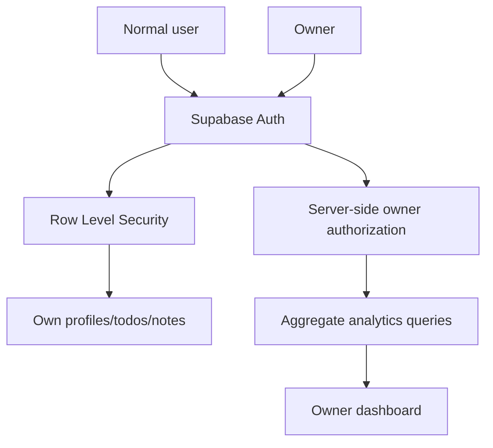
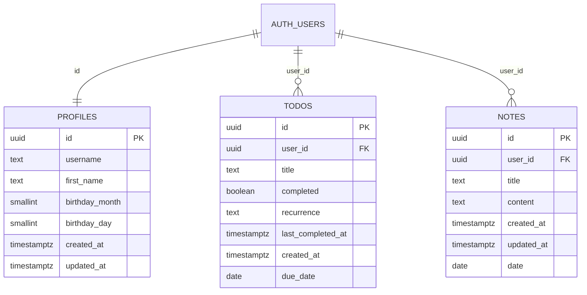
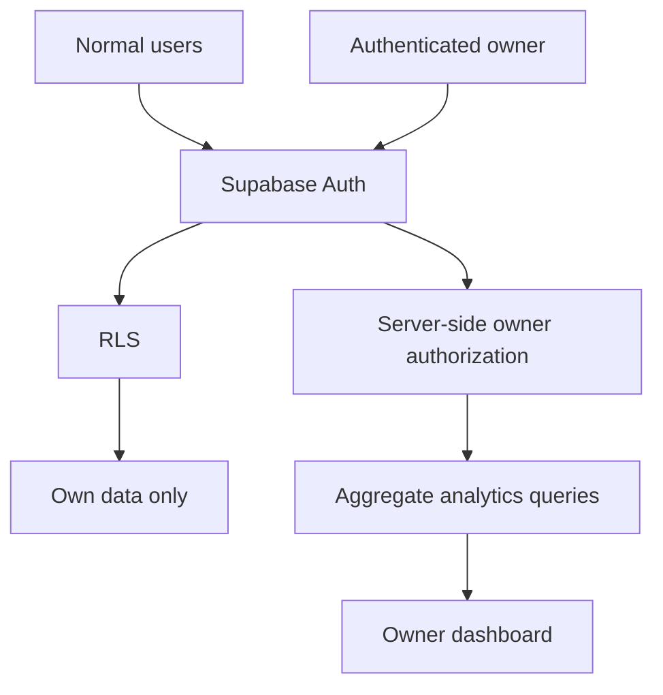

# PJB Daily Database Audit Report

**Project:** PJB Daily  
**Audit phase:** Phase 7.1  
**Audit method:** Read-only inspection of the live Supabase database  
**Platform:** Expo React Native  
**Backend:** Supabase  
**Database:** PostgreSQL  
**Purpose:** Determine whether the live database is ready for secure owner-only aggregate analytics.

## Purpose And Scope

This report records verified live database findings for PJB Daily. It focuses on schema structure, RLS, policies, grants, triggers, functions, indexes, account-deletion relationships, and analytics readiness.

This report does not claim that function bodies were audited. It does not include user-generated content, individual user records, emails, usernames, birthdays, task titles, note titles, note bodies, or secrets.

## Executive Summary

The database foundation is solid and no redesign is recommended. The live database contains the expected application tables:

- `public.profiles`
- `public.todos`
- `public.notes`

No related public owner, admin, analytics, telemetry, activity, or deletion tables currently exist.

The database is ready to proceed into Phase 7 Owner Analytics work, beginning with secure Owner Authorization.

## High-Level Architecture



Normal users should continue to access only their own rows through RLS. Owner analytics should use server-side owner authorization and aggregate-only queries.

## Authentication And Profile Creation Flow

Verified relationships:

- `profiles.id` references `auth.users.id`
- `todos.user_id` references `auth.users.id`
- `notes.user_id` references `auth.users.id`

All three foreign keys use `ON DELETE CASCADE`.

Profile creation is supported by an enabled auth trigger:

- `AFTER INSERT` on `auth.users`
- calls `public.pjb_profiles_create_for_auth_user()`

Profile updates are supported by a public trigger:

- `pjb_profiles_set_updated_at`
- `BEFORE UPDATE`
- `FOR EACH ROW`

## Entity Relationship Model



## Detailed Table Documentation

### public.profiles

Verified columns:

| Column | Type | Notes |
| --- | --- | --- |
| `id` | UUID | Primary key; references `auth.users.id` |
| `username` | text | Normalized unique expression index exists |
| `first_name` | text | Profile display/personalization field |
| `birthday_month` | small integer | Birthday personalization |
| `birthday_day` | small integer | Birthday personalization |
| `created_at` | timestamp | Profile creation timestamp |
| `updated_at` | timestamp | Updated by trigger |

### public.todos

Verified columns:

| Column | Type | Notes |
| --- | --- | --- |
| `id` | UUID | Primary key |
| `user_id` | UUID | References `auth.users.id` |
| `title` | text | User-generated content; do not expose in analytics |
| `completed` | boolean | Default `false` |
| `recurrence` | text | Default `'none'` |
| `last_completed_at` | timestamp | Completion telemetry source |
| `created_at` | timestamp | Creation telemetry source |
| `due_date` | date | Due-date usage source |

### public.notes

Verified columns:

| Column | Type | Notes |
| --- | --- | --- |
| `id` | UUID | Primary key |
| `user_id` | UUID | References `auth.users.id` |
| `title` | text | User-generated content; do not expose in analytics |
| `content` | text | User-generated content; do not expose in analytics |
| `created_at` | timestamp | Creation telemetry source |
| `updated_at` | timestamp | Update telemetry source |
| `date` | date | Nullable; note-date usage source |

## Constraints And Cascade Behavior

Primary keys:

- `profiles.id`
- `todos.id`
- `notes.id`

Foreign keys:

- `profiles.id` references `auth.users.id`
- `todos.user_id` references `auth.users.id`
- `notes.user_id` references `auth.users.id`

All inspected foreign keys use `ON DELETE CASCADE`, which supports future account deletion by reducing orphan risk.

Profile check constraints exist for:

- birthday completeness
- birthday validity
- username length
- first-name length

The inspected profile check constraints were marked `NOT VALID`. This should be treated as a future hardening item, not a current blocker.

## Username Normalization And Uniqueness

The database includes a normalized unique expression index:

```sql
profiles_username_normalized_unique_idx
```

Expression:

```sql
lower(btrim(username))
```

This prevents usernames that differ only by capitalization or surrounding whitespace.

## RLS And Policy Review

RLS is enabled on:

- `profiles`
- `todos`
- `notes`

RLS is not forced.

Ownership models:

- Profiles: `auth.uid() = id`
- Todos: `auth.uid() = user_id`
- Notes: `auth.uid() = user_id`

Todos and notes have `SELECT`, `INSERT`, `UPDATE`, and `DELETE` policies.

Observed future hardening opportunities:

- Todos and notes policies are assigned to the `public` role rather than specifically to `authenticated`.
- UPDATE policies do not include an explicit `WITH CHECK` clause.

These observations are not described here as active vulnerabilities. They should be reviewed in a future policy-hardening pass.

## Trigger And Function Review

Confirmed public trigger:

- `pjb_profiles_set_updated_at`
- `BEFORE UPDATE`
- `FOR EACH ROW`

Confirmed auth trigger:

- `AFTER INSERT` on `auth.users`
- calls `public.pjb_profiles_create_for_auth_user()`
- enabled

No inspected triggers were found on `todos` or `notes`.

Relevant functions:

- `public.pjb_profiles_create_for_auth_user`
- `public.pjb_profiles_set_updated_at`

Both functions:

- return `trigger`
- use `SECURITY DEFINER`
- have `search_path` set to `public, pg_temp`

Function bodies were not inspected as part of this audit.

## Grants And Permissions Review

Broad table grants were observed for:

- `anon`
- `authenticated`
- `service_role`

Observed privileges included:

- `SELECT`
- `INSERT`
- `UPDATE`
- `DELETE`
- `TRIGGER`
- `REFERENCES`
- `TRUNCATE`

RLS still protects normal row access. However, `TRIGGER`, `REFERENCES`, and `TRUNCATE` are broader than necessary for normal mobile app operation and should be reviewed during a future security-hardening pass.

Function `EXECUTE` grants were observed for:

- `PUBLIC`
- `anon`
- `authenticated`
- `service_role`
- `postgres`

Broad `EXECUTE` access on `SECURITY DEFINER` trigger functions should be reviewed as a future hardening item.

## Index And Performance Review

Confirmed indexes:

- primary-key indexes
- `profiles_username_normalized_unique_idx`

No additional inspected indexes were found for:

- `todos.user_id`
- `todos.due_date`
- `notes.user_id`
- `notes.date`

These are possible future performance indexes. This audit does not conclude that the app currently has a performance problem.

## Extensions And Infrastructure

Installed extensions observed:

- `pgcrypto`
- `uuid-ossp`
- `pg_stat_statements`
- `supabase_vault`
- `plpgsql`

Views and sequences:

- no public views found
- no public materialized views found
- no public sequences found

## Security-Hardening Recommendations

Future work:

1. Restrict `EXECUTE` privileges on trigger functions.
2. Review and reduce unnecessary table grants.
3. Add explicit `WITH CHECK` clauses to UPDATE policies.
4. Validate the existing `NOT VALID` profile constraints after confirming historical rows comply.
5. Consider indexes for user and date filtering when actual query volume justifies them.

## Analytics-Readiness Assessment

The database is ready to proceed into Phase 7 Owner Analytics work, beginning with secure Owner Authorization.

Owner analytics must expose aggregate metrics only. The owner dashboard should not allow browsing contents of individual users' notes or to-dos.

Recommended target architecture:



## Risk Assessment

Low-to-moderate risks for Phase 7:

- accidental exposure of content fields in owner analytics
- owner authorization implemented in the client instead of the database
- broad grants remaining wider than necessary
- future aggregate queries becoming expensive without indexes
- account deletion relying on cascade behavior without an explicit user-facing deletion workflow

## Phase 7 Roadmap

- Phase 7.1: Live database audit - complete
- Phase 7.2: Owner Authorization - next
- Phase 7.3: Analytics Foundation
- Phase 7.4: Owner Dashboard

## Long-Term Maintenance Recommendations

- Re-run metadata inspections before every database-related release.
- Keep analytics aggregate-only by default.
- Avoid service-role keys in the mobile application.
- Review RLS policies after every schema change.
- Add migration review notes to future database changes.
- Revisit performance indexes after real analytics query patterns are known.

## Audit Summary Appendix

Verified:

- three application tables exist
- profile, todo, and note foreign keys cascade on auth user deletion
- RLS is enabled on application tables
- profile creation/update triggers exist
- no public owner/admin/analytics/activity/deletion tables currently exist
- no public views, materialized views, or sequences were found

Not audited:

- function bodies
- user-generated content
- individual user records
- service-role behavior
- actual production query volume

