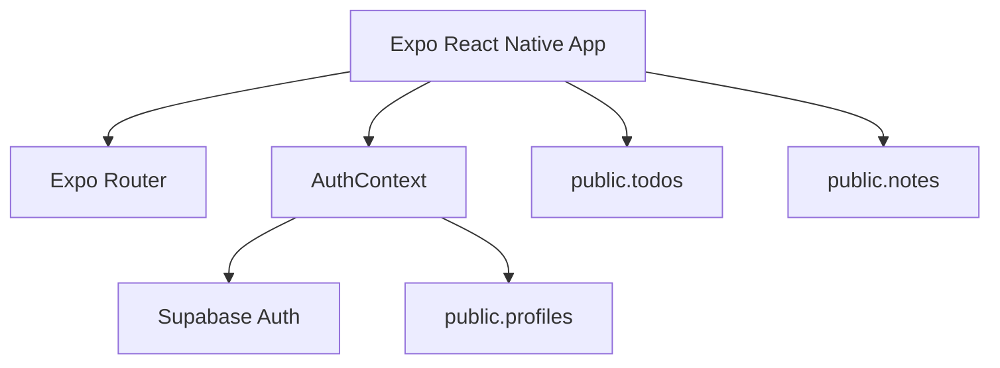

# PJB Daily Master Project Reference

**Project:** PJB Daily  
**Platform:** Expo React Native mobile application  
**Language:** TypeScript  
**Navigation:** Expo Router  
**Backend:** Supabase authentication and PostgreSQL database  
**Status:** Phase 6 complete; Phase 7 Owner Analytics in progress

This is a living reference for the PJB Daily project. Update it whenever architecture, release strategy, database structure, or major product decisions change.

## Product Summary

PJB Daily is a productivity app centered on daily planning. The main product areas are:

- Calendar
- To-Dos
- Notes
- Daily Briefing
- Profile

The app uses a calendar-centered workflow supported by authentication, profile data, recurring tasks, autosave, dark mode, and responsive UI polish.

## Current Phase Map

- Phase 6: Daily Briefing and UX polish - complete
- Phase 7: Owner Analytics - active
- Phase 7.1: Database Audit - complete
- Phase 7.2: Owner Authorization - next
- Phase 8: Production Release - future

## Repository Reference

- `app/`: Expo Router screens and route groups.
- `app/(tabs)/`: primary authenticated tabs.
- `components/`: reusable visual and feature components.
- `contexts/`: React context providers for auth, todos, notes, calendar, and theme.
- `lib/`: Supabase client, profile service, and query client.
- `utils/`: date, recurrence, profile, and Daily Briefing helpers.
- `constants/`: color and design tokens.
- `supabase/`: reviewed migration and inspection SQL.
- `docs/`: durable project documentation.

## Core Technical Architecture

The app uses Supabase Auth for authentication and `public.profiles` for application profile data. To-dos and notes are stored in Supabase tables and loaded through React context providers.

## Key Documentation

- [Database Audit Report](./DATABASE_AUDIT_REPORT.md)
- [Architecture](./ARCHITECTURE.md)
- [Database Schema](./DATABASE_SCHEMA.md)
- [Roadmap](./ROADMAP.md)
- [Changelog](./CHANGELOG.md)
- [Release Checklist](./RELEASE_CHECKLIST.md)

## Current Owner Analytics Principle

Owner analytics must expose aggregate metrics only. The owner dashboard must not allow browsing individual users' notes, to-dos, profile fields, or generated content.

